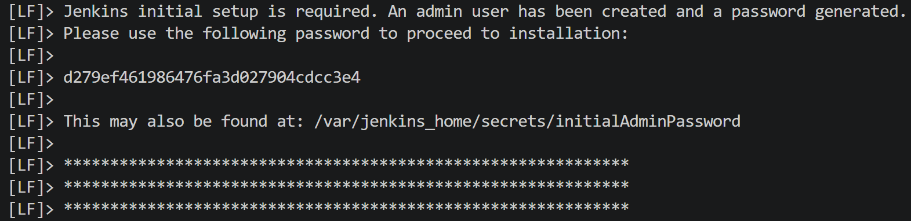
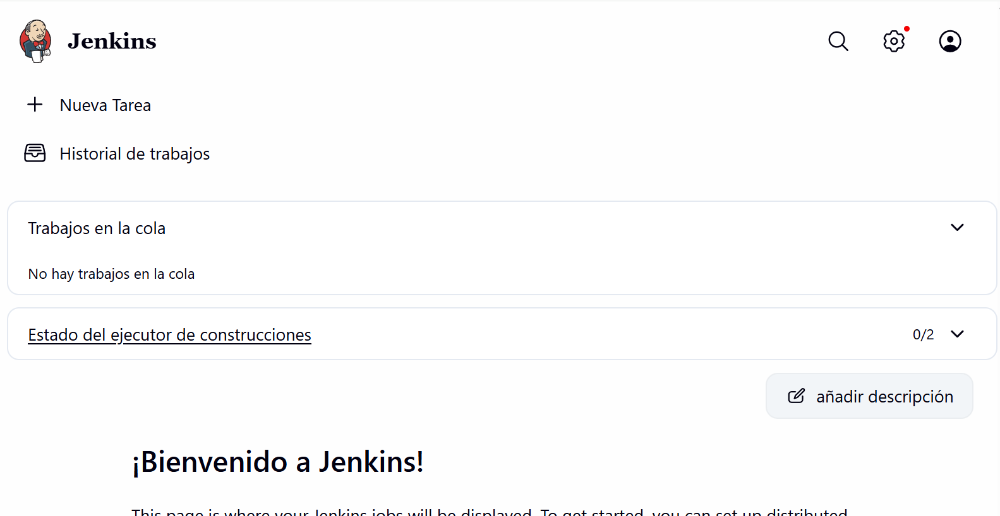
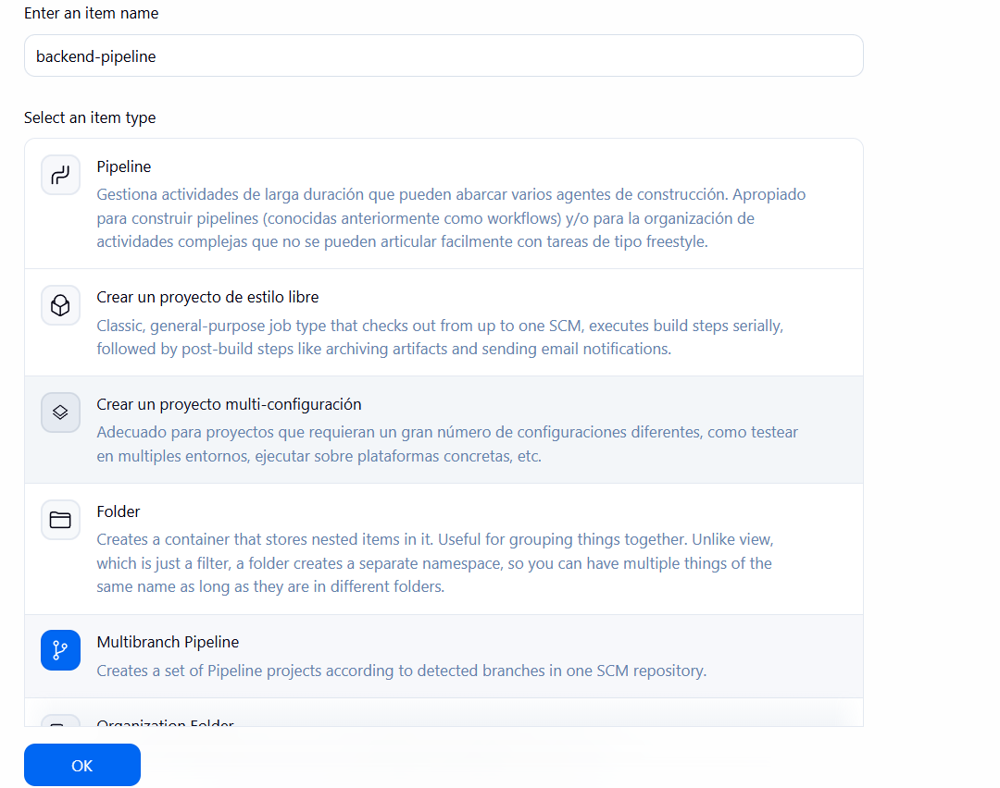
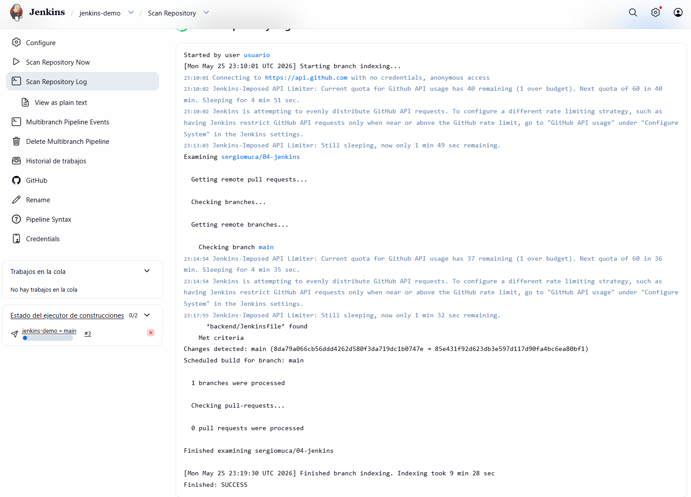

# DIARIO.md

# Laboratorio Jenkins CI/CD para Backend Node.js

## Introducción

En esta práctica se ha configurado un flujo de integración y despliegue continuo (CI/CD) utilizando Jenkins sobre un proyecto backend desarrollado en Node.js. El objetivo principal ha sido automatizar el proceso de instalación de dependencias, validación del código, ejecución de pruebas y construcción del proyecto mediante un fichero `Jenkinsfile` integrado en un repositorio GitHub y ejecutado desde un proyecto MultiBranch Pipeline en Jenkins.

---

# Paso 1: Preparación del Repositorio en GitHub

El primer paso consistió en subir el contenido del directorio `backend` a un repositorio público de GitHub para permitir que Jenkins pudiera acceder al código fuente mediante HTTP.

## Inicialización del repositorio local

Desde la terminal situada en la carpeta `backend` se ejecutó el siguiente comando:

```bash
git init
```

Con este comando se inicializó un nuevo repositorio Git local.

## Añadir archivos y realizar el primer commit

Posteriormente se añadieron todos los archivos al área de preparación y se creó el primer commit:

```bash
git add .
git commit -m "Initial backend commit"
```

## Creación del repositorio remoto en GitHub

A continuación, se creó un repositorio público en GitHub desde la interfaz web.

## Configuración del repositorio remoto

Una vez creado el repositorio, se vinculó el repositorio local con GitHub mediante:

```bash
git remote add origin <URL_DE_TU_REPOSITORIO>
```

## Subida del proyecto a GitHub

Finalmente, se subieron todos los cambios al repositorio remoto:

```bash
git push -u origin main
```

De esta forma, el código fuente quedó accesible públicamente para Jenkins.

---

# Paso 2: Creación del archivo Jenkinsfile

El siguiente paso fue crear el archivo `Jenkinsfile` en la raíz del proyecto `backend`. Este fichero define todo el flujo CI/CD que Jenkins ejecutará automáticamente.

El contenido del archivo fue el siguiente:

```groovy
pipeline {
    agent any // Se ejecuta en el nodo principal de Jenkins

    options {
        disableConcurrentBuilds() // Deshabilita builds concurrentes
        timestamps() // Muestra marcas de tiempo
        timeout(time: 5, unit: 'MINUTES') // Timeout de 5 minutos
    }

    environment {
        FORCE_COLOR = '0' // Variable de entorno numérica
        NO_COLOR = 'true' // Variable de entorno booleana
    }

    stages {

        stage('Audit tools') {
            steps {
                sh 'node --version' // Muestra la versión de Node.js
            }
        }

        stage('Install dependencies') {
            steps {
                sh 'npm install' // Instala las dependencias del proyecto
            }
        }

        stage('Generate files') {
            steps {
                sh 'npm run prisma:generate' // Genera archivos automáticos de Prisma
            }
        }

        stage('Format check') {
            steps {
                sh 'npm run format:check' // Verifica el formato del código
            }
        }

        stage('Code quality') {
            steps {
                sh 'npm run lint' // Ejecuta el análisis de calidad del código
            }
        }

        stage('Type check') {
            steps {
                sh 'npm run type-check' // Comprueba los tipos TypeScript
            }
        }

        stage('Tests') {
            steps {
                sh 'npm run test' // Ejecuta los tests automáticos
            }
        }

        stage('Build') {
            steps {
                sh 'npm run build' // Construye la aplicación

                // Archiva los artefactos generados
                archiveArtifacts artifacts: 'dist/**', fingerprint: true
            }
        }
    }

    post {

        success {
            echo 'Pipeline completed successfully!'
        }

        failure {
            echo 'Pipeline failed. Review logs.'
        }

        always {
            cleanWs() // Limpia el workspace al finalizar
        }
    }
}
```

## Subida del Jenkinsfile a GitHub

Una vez creado el archivo, se añadió al repositorio y se subieron los cambios:

```bash
git add Jenkinsfile
git commit -m "Add Jenkinsfile"
git push
```

---

# Paso 3: Configuración del proyecto MultiBranch Pipeline en Jenkins

Con el repositorio ya preparado, se procedió a configurar Jenkins para ejecutar automáticamente el pipeline definido en el `Jenkinsfile`.
---
## 1. Asegurarse de que el servidor Jenkins esté corriendo

Antes de acceder a Jenkins, primero es necesario levantar el servicio utilizando Docker Compose.

Desde la terminal, situándose en la carpeta del proyecto, se ejecutó:

```bash
docker-compose up
```

Tras ejecutar el comando, Docker comenzó a descargar las imágenes necesarias e iniciar el contenedor de Jenkins.

---

## 2. Acceder a Jenkins desde el navegador

Una vez que Jenkins terminó de arrancar correctamente, se abrió el navegador web y se accedió a la siguiente dirección:

```text
http://localhost:8080
```

Desde esta URL se accede a la interfaz web de Jenkins.

---

## 3. Primer inicio de sesión en Jenkins

Al acceder por primera vez, Jenkins solicita una contraseña inicial de administrador.

### Obtener la contraseña desde los logs

En la consola donde se ejecutó Docker Compose, Jenkins muestra una sección similar a la siguiente:

```text
*************************************************************
Jenkins initial setup is required.
An admin user has been created and a password generated.
*************************************************************
 Please use the following password to proceed to installation:
jenkins         | [LF]> 
jenkins         | [LF]> d279ef461986476fa3d027904cdcc3e4
```

Debajo de ese mensaje aparece la contraseña inicial.

### Obtener la contraseña mediante comando

Si no se dispone de los logs, también es posible obtener la contraseña ejecutando:

```bash
docker compose exec jenkins cat /var/jenkins_home/secrets/initialAdminPassword
```

Este comando devuelve el código necesario para desbloquear Jenkins.

---

## 4. Acceder al panel principal de Jenkins

Tras introducir la contraseña inicial:

1. Jenkins solicitó instalar plugins recomendados.
2. Se creó un usuario administrador.
3. Finalmente se accedió al panel principal de Jenkins.

Por ejemplo, se utilizó el siguiente usuario:

```text
Usuario: usuario
Contraseña: usuario
```
---

## 5. Crear el proyecto MultiBranch Pipeline

Desde el panel principal de Jenkins se realizaron los siguientes pasos:

1. En el menú lateral izquierdo, pulsar sobre:

```text
New Item
```

2. Introducir el nombre del proyecto:

```text
backend-pipeline
```

3. Seleccionar la opción:

```text
Multibranch Pipeline
```

4. Pulsar el botón:

```text
OK
```

---

## 6. Configuración del repositorio GitHub

Dentro de la configuración del proyecto:

1. Localizar la sección `Branch Sources`.
2. Pulsar `Add source`.
3. Seleccionar `GitHub`.
4. Introducir la URL HTTPS del repositorio GitHub.

Ejemplo:

```text
https://github.com/sergiomuca/04-jenkins
```

---

## 7. Configuración de credenciales

Aunque el repositorio es público, se recomendó utilizar un Personal Access Token (PAT) de GitHub configurado en Jenkins como credencial del tipo:

```text
Username with password
usuario:usuario
```

Esto ayuda a evitar problemas de limitación de peticiones (`rate limiting`) de GitHub.

---

## 8. Configuración del Jenkinsfile

En el apartado `Build Configuration` se configuró:

- Modo:

```text
by Jenkinsfile
```

- Script Path:

```text
Jenkinsfile
```

Finalmente se pulsó `Save`.

Tras guardar la configuración, Jenkins realizó automáticamente un escaneo del repositorio, detectó la rama `main` y lanzó la primera ejecución del pipeline.

---

# Paso 4: Verificación de resultados

Una vez completada la ejecución del pipeline, se verificaron distintos aspectos del funcionamiento del sistema CI/CD.

## Verificación de logs y acciones post-ejecución

Desde `Console Output` y `Pipeline Overview` se comprobó:

- La correcta ejecución de todas las etapas definidas.
- La aparición de mensajes de éxito o error según el resultado de la build.

Mensaje esperado en caso de éxito:

```text
Pipeline completed successfully!
```

Mensaje esperado en caso de error:

```text
Pipeline failed. Review logs.
```

También se verificó que el workspace fuese limpiado automáticamente mediante la directiva:

```groovy
cleanWs()
```

## Verificación de artefactos generados

Dentro de la ejecución del job (`Build #1`) se accedió a la sección:

```text
Build Artifacts
```

En esta sección se comprobó:

- El archivado correcto del directorio `dist/`.
- La presencia del archivo:

```text
server.mjs
```

Esto confirmó que Jenkins había construido correctamente la aplicación y almacenado los artefactos generados.

---
# Capturas
## Imagen 1



---

## Imagen 2



---

## Imagen 3



## Imagen 4


# Conclusiones

Con esta práctica se consiguió implementar correctamente un pipeline CI/CD básico utilizando Jenkins y GitHub sobre una aplicación backend Node.js. Se automatizó la instalación de dependencias, generación de archivos, validación del código, ejecución de pruebas y construcción del proyecto, además del archivado automático de artefactos.

La integración entre GitHub y Jenkins mediante un proyecto MultiBranch Pipeline permitió que cada cambio subido al repositorio fuese detectado y ejecutado automáticamente, facilitando así un flujo de trabajo más profesional y automatizado.
